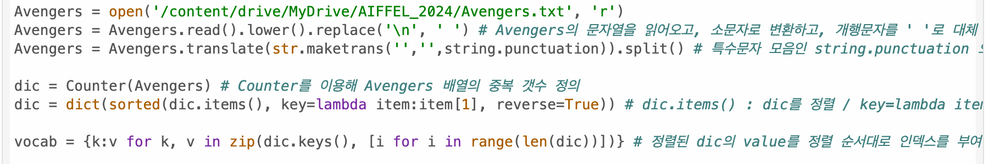

# AIFFEL Campus Online Code Peer Review Templete
- 코더 : 김지혜
- 리뷰어 : 김민규(03)

# PRT(Peer Review Template)
- [V]  **1. 주어진 문제를 해결하는 완성된 코드가 제출되었나요?**

    결과물 산출되었습니다!
    
- [V]  **2. 전체 코드에서 가장 핵심적이거나 가장 복잡하고 이해하기 어려운 부분에 작성된 
주석 또는 doc string을 보고 해당 코드가 잘 이해되었나요?**

    코드 내용의 참고자료 등 좀 더 포함되어 있었더라면 좋았을 것으로 보입니다. 
    
    

        
- [ ]  **3. 에러가 난 부분을 디버깅하여 문제를 해결한 기록을 남겼거나
새로운 시도 또는 추가 실험을 수행해봤나요?**
    
    코드가 간략해진 만큼 중간의 데이터 확인을 위한 주석처리된 부분이 보였으면 더 좋았을 것으로 보입니다. 
        
- [ ]  **4. 회고를 잘 작성했나요?**

    코드 작성하는데 꽤 시간이 걸리셨을 것으로 보입니다. 회고가 좀 더 자세했으면 하는 아쉬움이 있습니다. 
    

        
- [V]  **5. 코드가 간결하고 효율적인가요?**

    장황하지 않고 매우 간략하면서도 큰 고민이 보이는 코드 작성이라고 생각합니다. 

    

# 회고(참고 링크 및 코드 개선)

### 김민규(03)
코드 작성에 있어서 고민을 많이 한 점이 보입니다. 
특히 Counter 모듈을 저도 사용했더라면 좋았겠구나라는 생각을 하게 되었습니다. 
특수문자 제거하는 부분은 아무래도 regular expression을 좀 더 고민해보는게 어떤가 생각하게 됩니다.
어떠한 코드 작성 스타일이 pythonic 한 것인지는 아직 잘 모르겠습니다만, 개인적으로는 김지혜님 작성한 코드처럼 작성하는게 
좀 더 장황하지 않고 간략하지 않은가 라는 생각을 했습니다. 
