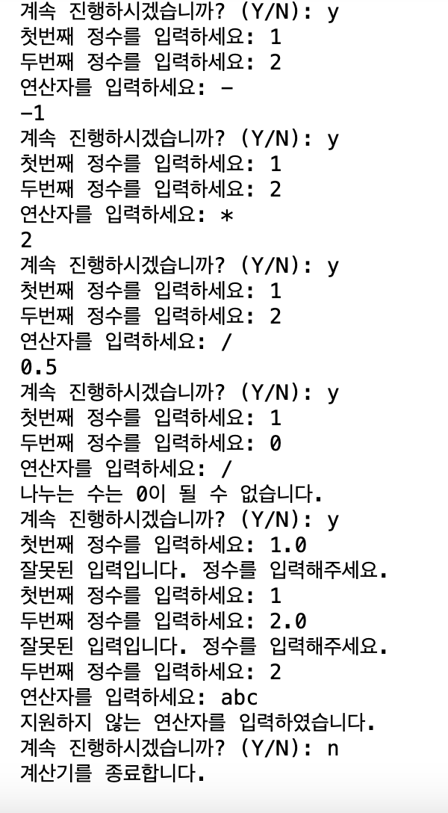
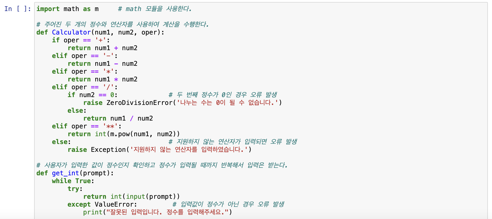
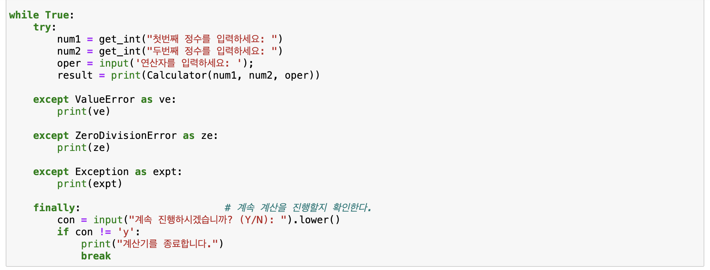
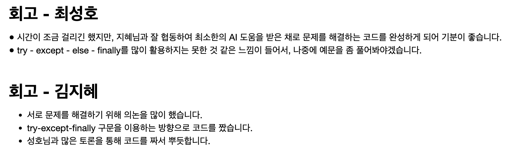

# AIFFEL Campus Online Code Peer Review Templete
- 코더 : 김지혜
- 리뷰어 : 김우찬

# PRT(Peer Review Template)
- [x]  **1. 주어진 문제를 해결하는 완성된 코드가 제출되었나요?**
    - 문제에서 요구하는 최종 결과물이 잘 첨부되었습니다.
        
        
- [x]  **2. 전체 코드에서 가장 핵심적이거나 가장 복잡하고 이해하기 어려운 부분에 작성된 
주석 또는 doc string을 보고 해당 코드가 잘 이해되었나요?**
    - 메인 함수(get_int) 함수의 try, except 함수가 가장 핵심인 것 같습니다.
    - 다른 오류가 발생하더라도, finally로 가게 만들어 큰 문제 없이 출력을 할 수 있도록 잘 작성해주셨습니다.
        
        

- [ ]  **3. 에러가 난 부분을 디버깅하여 문제를 해결한 기록을 남겼거나
새로운 시도 또는 추가 실험을 수행해봤나요?**
    - 코드 작성 과정에서 특별한 문제가 보이지 않았습니다.
        
- [x]  **4. 회고를 잘 작성했나요?**
    - 퀘스트 과정에서 뜨거운 토의를 하셨던 것이 회고와 PRT시 설명해주시는 과정에서 느껴졌습니다.
        
        
- [x]  **5. 코드가 간결하고 효율적인가요?**
    - 저희 팀이 작성한 함수가 3개인 반면, 지혜님이 작성한 코드 함수는 2개로, 제가 작성한 것보다 훨씬 간결하고 효율적입니다.

# 회고(참고 링크 및 코드 개선)

'''
김우찬
- 전반적으로 저희 조가 짰었던 코드보다 효율적인 코드였습니다. 잘 작성해주셨습니다.
- 마지막 연산을 지속하기 위해 if 문에서 con != y를 사용하셨습니다. 이런 경우, n이 아닌 다른 어떠한 단어를 눌러도 종료가 될 수 있는 만큼, While true 문과 함께 if, elif, else를 사용하여 y인경우 재출력, n인경우 종료, 그 외의 단어를 입력한 경우 '오류입니다. 재입력하세요.'와 같은 입력이 진행되면 더 좋았을 것 같습니다.  
- 저희 조 코드와 마찬가지로, 연산자를 잘못 입력하였을 때에도 맨 아래로 출력이 아닌, 연산자를 재입력하도록 While True 문을 추가하면 더 좋을 것 같습니다. 저희 조도 수정하지 못했습니다. 
- 너무 고생하셨습니다!
'''